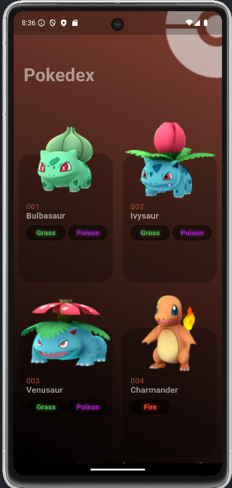
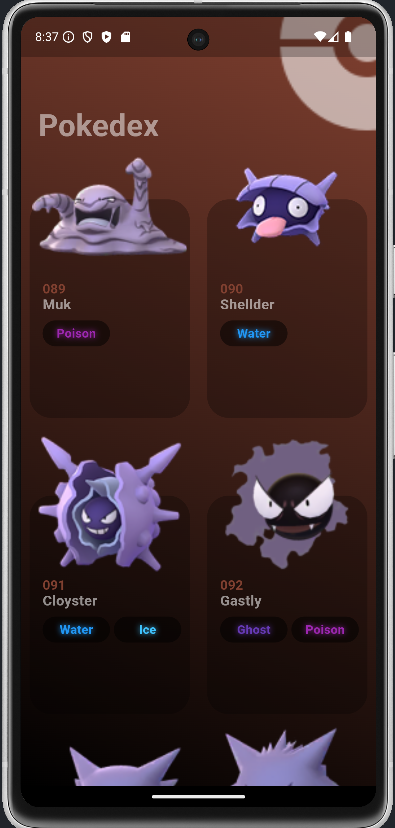
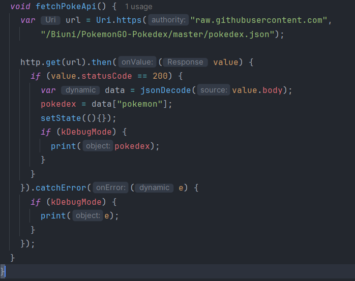
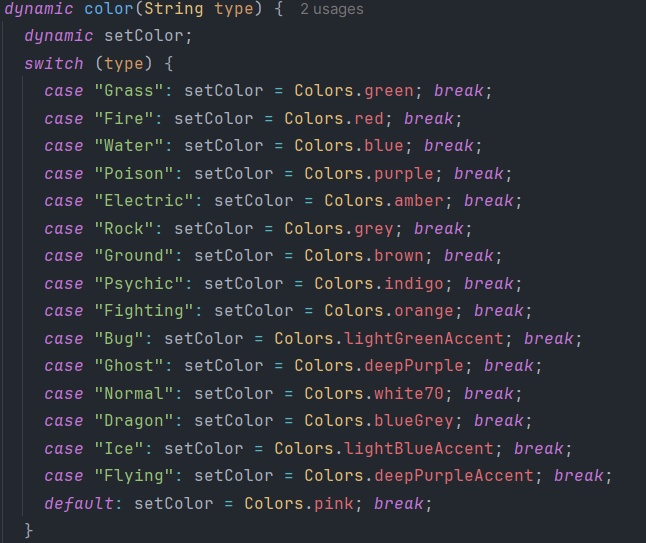
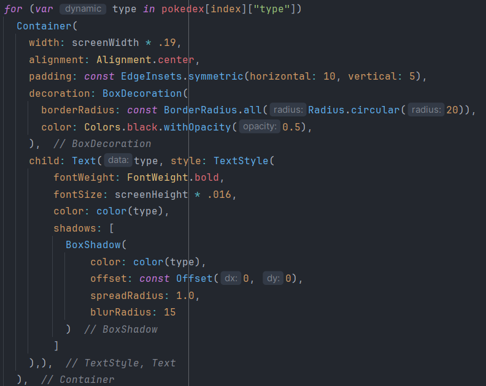
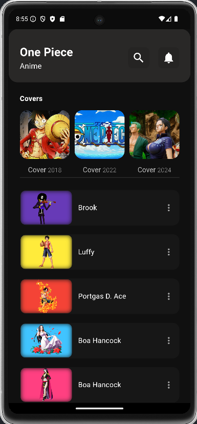
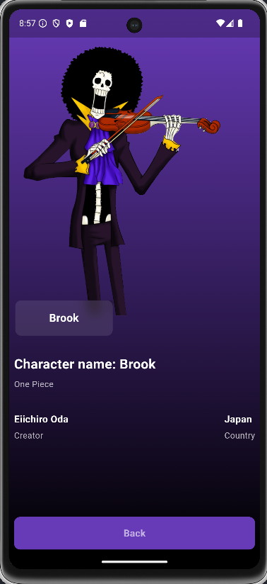
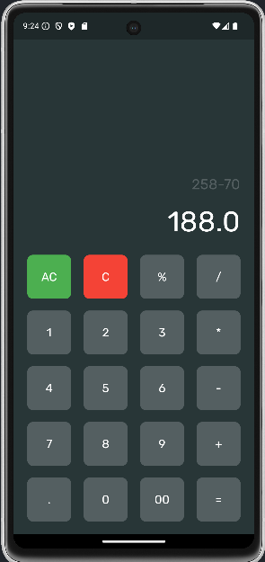
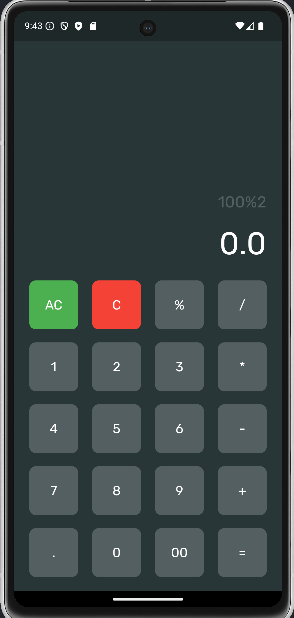

# Flutter projects

These are the projects that I made to learn flutter framework and dart.

# POKEAPI

#### POKEAPI - Calling the API

#### POKEAPI - Colors

#### POKEAPI - Pokemon's type handle

# OnePiece Characters List
There is wrong information, this is just 

It has animations between characters first page and character main page

# Calculator
All functionalities are working, it's a simple calculator, for simple calculations

